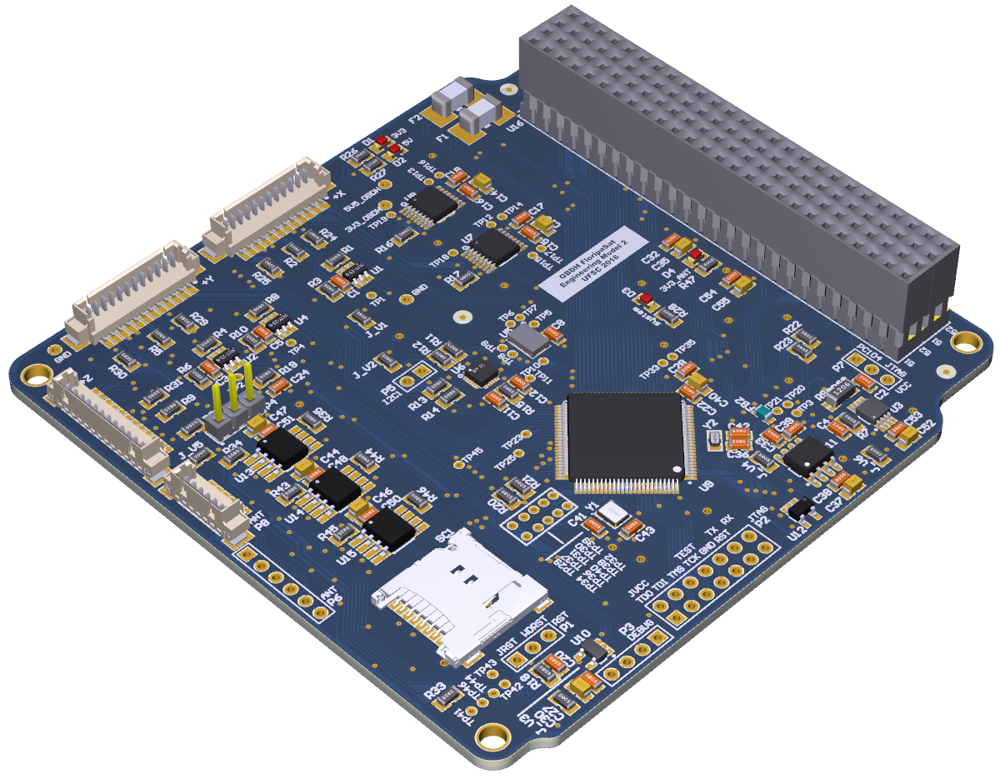
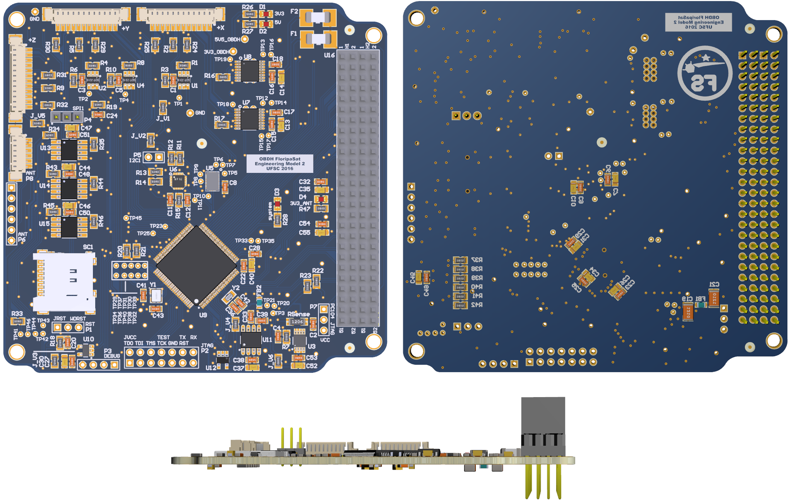

# OBDH
On-Board Data Handling module of the FloripaSat Cubesat Project

The main goal of On Board Data Handling, a.k.a. OBDH, is manage all the cubesat information aimming to reach the mission goal.

## Hardware

* The MCU used in this module is the [MSP430F6659](http://www.ti.com/product/MSP430F6659);
* The tracking IC used is [MPU9250](https://www.invensense.com/products/motion-tracking/9-axis/mpu-9250/), which contains a 9-axis sensors (3-axis each): a gyroscope, an accelerometer and a compass;
* For space-ground communications, is used the radio transceiver [CC1125](http://www.ti.com/product/CC1125);
* Detailed information can be found [here](https://github.com/floripasat/obdh/hardware/).

## Software

* The programming language is C;
* All software was developed in the [Code Composer Studio IDE](http://www.ti.com/tool/ccstudio).
* Tested in compiler TI v16.9.1 LTS (CCS v7.1 7.1.0.00015).
* Uses FreeRTOS, a RTOS for embedded systems. [FreeRTOS page](http://freertos.org/);
* Detailed information can be found [here](https://github.com/floripasat/obdh/firmware/).
<!-- * Doxygen documentation [here](http://fsat-server.duckdns.org:8000/obdh/). nao foi feito ainda -->

### Toolchain setup
* Download and install Code Composer Studio: http://processors.wiki.ti.com/index.php/Download_CCS
* Instructions for for Linux enviroment: http://processors.wiki.ti.com/index.php/Linux_Host_Support_CCSv7
* Select package: MSP430 Ultra Low Power MCUs 
* After installed, open and update CCSv7: Help->Check for Updates->Select All-> Update.. / Restart
* Get the source code: `git clone https://github.com/floripasat/obdh`
* Import source project into CCSv7: File->Import->Code Composer Studio->CCS Projects; Select the source folder: obdh/firmware; Leave 'Copy projects into workspace' unchecked.
## References

The general documentation of the project can be found in [GitBook](https://www.gitbook.com/book/tuliogomesp/floripasat-technical-manual).

All source code of the project can be found in [GitHub](https://github.com/floripasat).

The official website of the project is [www.floripasat.ufsc.br](http://www.floripasat.ufsc.br/).

